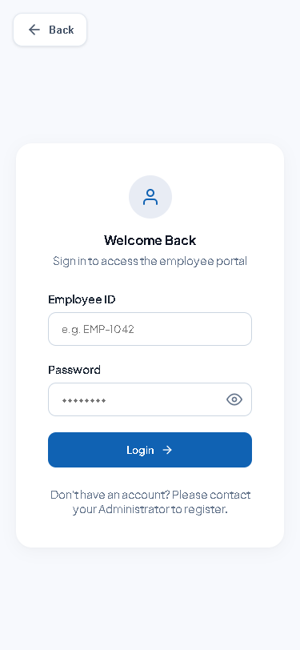
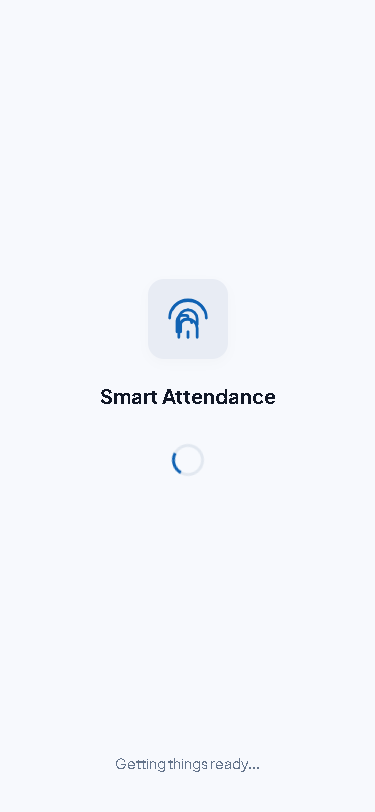
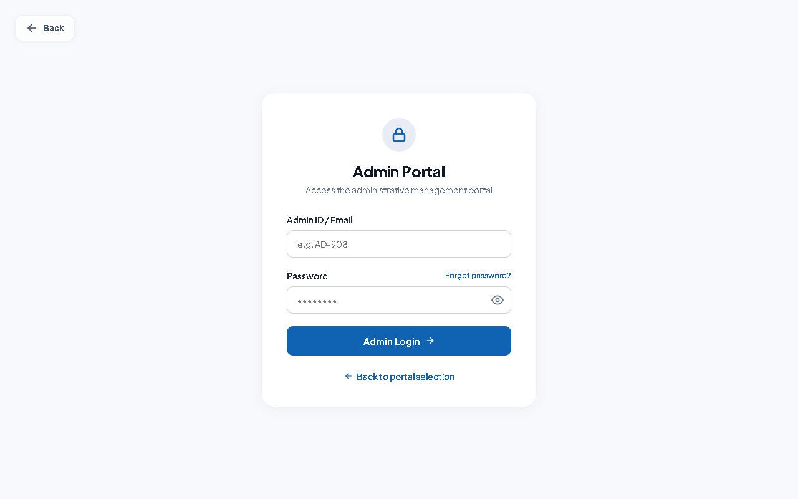

# Smart Attendance System: Official User Manual

## 1. Introduction
Welcome to the Smart Attendance System! This system leverages your device's built-in camera and GPS to ensure accurate, fast, and secure check-ins. This guide will help both Employees and Administrators understand how to use the system.

## 2. Getting Started
Before using the system, your IT Administrator or HR Department will create an account for you and register your facial biometrics.
1. Navigate to the portal URL or open the mobile application.
2. Enter your company Email Address and temporary password.
3. On your first login, change your password to something secure.

## 3. Employee Guide: The Dashboard
Upon successful login, you will see the Employee Dashboard.
- Digital Clock & Date: Displays the current server time.
- Check In / Check Out Button: The primary action button.
- Location Map: Shows your current GPS location relative to the office.
- Recent Activity: A list of your check-ins for the current week.

## 4. Employee Guide: Check-In Process
1. Verify Location: Ensure the map shows you are inside the office radius.
2. Initiate Check-In: Tap the large Check In button.
3. Camera Activation: Your front-facing camera will activate.

4. Align Your Face: Center your face within the scanning frame. Stand in a well-lit area.
5. Hold Still: Wait 1-2 seconds for the system to verify your identity.
6. Confirmation: A success message will appear, and your dashboard will update.

## 5. Employee Troubleshooting
- "Location Outside Geofence": Step near a window to improve GPS signal, or ensure Location Services are enabled on your phone.
- "Face Not Recognized": Move to a brighter area, clean your camera lens, and ensure no one else is in the background.

## 6. Administrator Guide: Dashboard
Administrators have access to a desktop interface to view organizational attendance.

- Key Metrics: View total employees, present today, absent, and late arrivals.
- Real-Time Feed: Monitor incoming check-ins as they happen.

## 7. Administrator Guide: Managing Employees
- Adding a New Employee: Navigate to the Employees tab, click Add New, and fill out their details.
- Capturing Biometrics: Click the Biometrics icon next to an employee, ask them to face the webcam, and capture their registration photos.
- Manual Overrides: If an employee's phone dies, open their profile, click Manual Entry, and log their attendance with a mandatory remark.

## 8. Administrator Guide: Reporting
- Generating a Report: Navigate to the Reports tab, select a Date Range and Department, and click Generate.
- Exporting Data: You can export the generated reports as a CSV file to import directly into your payroll software.
